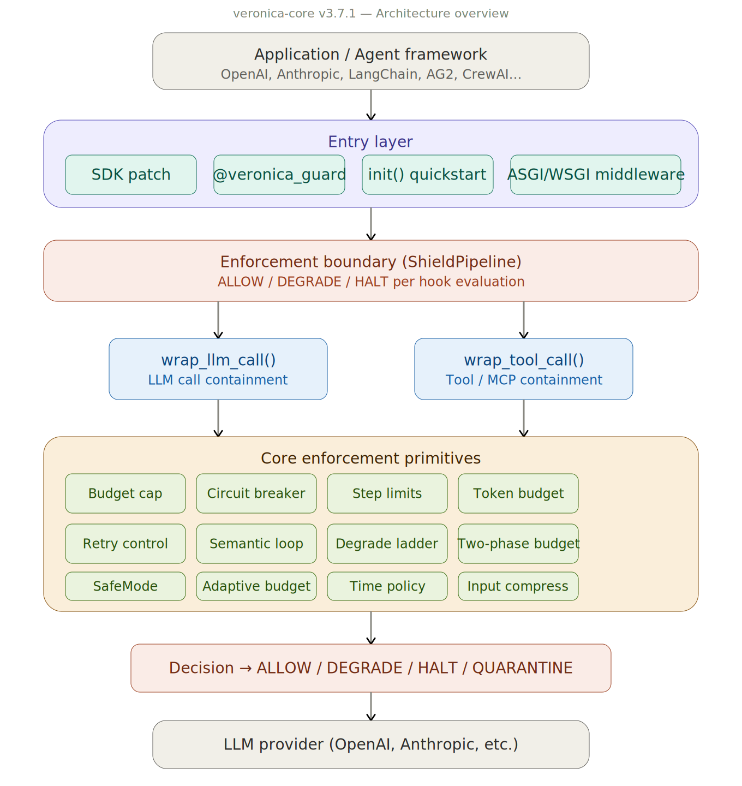

# VERONICA-core


VERONICA-Core is a zero-dependency runtime containment library for LLM agents, enforcing budget, step, retry, and circuit-breaker limits before failures turn into runaway execution.

It is not a prompt filter.
It is not a semantic guardrail.
It is an execution enforcement kernel.

```bash
pip install veronica-core
```

Zero required dependencies. Operationally stable at v3.9.0. Python 3.10+. Works with any LLM provider.

---

## What VERONICA-Core does

- **Budget ceiling** -- hard cost cap per chain. The call is blocked before it reaches the model when the cap is exceeded.
- **Step limit** -- bounded recursion depth. Agent loops cannot run indefinitely.
- **Retry containment** -- 3 layers x 4 retries would produce 64 API calls. VERONICA-Core caps the total at your limit.
- **Circuit breaker** -- per-entity failure counting with automatic COOLDOWN (local or Redis-backed).
- **4-tier degradation** -- ALLOW -> DEGRADE -> RATE_LIMIT -> HALT. The call does not proceed past HALT.
- **Policy-based execution** -- 80+ declarative rule types, YAML/JSON, hot-reload, ed25519 signing.

---

## What it does not do

- No prompt content filtering
- No output moderation or semantic classification
- No hosted control plane (that is [veronica](https://github.com/amabito/veronica-public), a separate repo)
- No high-availability or federation (planned for v4.0)
- No scheduling, routing, or orchestration

If you want to filter prompt content, use [guardrails-ai](https://github.com/guardrails-ai/guardrails) or [NeMo Guardrails](https://github.com/NVIDIA/NeMo-Guardrails). VERONICA-Core caps resource consumption; it does not inspect what the content says.

---

## Quickstart

Two lines. Your existing agent code unchanged. Hard ceiling at $1.00:

```python
from veronica_core.patch import patch_openai
from veronica_core import veronica_guard

patch_openai()

@veronica_guard(max_cost_usd=1.0, max_steps=20)
def run_agent(prompt: str) -> str:
    from openai import OpenAI
    return OpenAI().chat.completions.create(
        model="gpt-4o-mini",
        messages=[{"role": "user", "content": prompt}],
    ).choices[0].message.content
```

Full control with `ExecutionContext`:

```python
from veronica_core import ExecutionContext, ExecutionConfig, WrapOptions

def simulated_llm_call(prompt: str) -> str:
    return f"response to: {prompt}"

config = ExecutionConfig(
    max_cost_usd=1.00,    # hard cost ceiling per chain
    max_steps=50,         # hard step ceiling
    max_retries_total=10,
    timeout_ms=0,
)

with ExecutionContext(config=config) as ctx:
    for i in range(3):
        decision = ctx.wrap_llm_call(
            fn=lambda: simulated_llm_call(f"prompt {i}"),
            options=WrapOptions(
                operation_name=f"generate_{i}",
                cost_estimate_hint=0.04,
            ),
        )
        if decision.name == "HALT":
            break

snap = ctx.get_graph_snapshot()
print(snap["aggregates"])
# {"total_cost_usd": 0.12, "total_llm_calls": 3, ...}
```

---

## Core runtime controls

### Budget enforcement

Hard cost ceiling per chain. The reserve/commit two-phase protocol prevents double-spending across concurrent calls. When the ceiling is reached, the decision is HALT before the call is dispatched.

### Step and loop limits

Bounded recursion depth per entity. A `max_steps` limit stops agents from looping past a fixed count. Semantic loop detection (word-level Jaccard similarity, no ML dependencies) catches repeated content without requiring an additional model call.

### Retry amplification

When retries are nested, they multiply. `max_retries_total` caps the total across all layers. Jitter and backoff are configurable.

### Circuit breaker

Per-entity failure counting with CLOSED -> OPEN -> HALF_OPEN states. Local backend or Redis-backed for shared state across workers. `DistributedCircuitBreaker` uses a Lua script for atomic slot reservation.

### Policy-based execution

`PolicyEngine` evaluates rules before each step. 80+ built-in rule types covering shell commands, network destinations, filesystem paths, token budgets, and agent identity. Rules load from YAML or JSON, hot-reload without restart, and sign with ed25519 for tamper detection.

---

## Adapters and integrations

12 adapters ship with the library. All adapters use `ExecutionContext` internally.

| Framework | Adapter | Notes |
|-----------|---------|-------|
| OpenAI SDK | `patch_openai()` | Monkey-patch; no code changes required |
| Anthropic SDK | `patch_anthropic()` | Same patch pattern |
| LangChain | `VeronicaCallbackHandler` | Callback-based |
| AG2 (AutoGen) | `CircuitBreakerCapability` | `AgentCapability` protocol; [PR #2430](https://github.com/ag2ai/ag2/pull/2430) merged in AG2 v0.11.3 |
| AG2 eligibility | `AgentEligibilityPolicy` | Per-agent step gate |
| LlamaIndex | `VeronicaLlamaIndexHandler` | Handler-based |
| CrewAI | `VeronicaCrewAIListener` | Listener-based |
| LangGraph | `VeronicaLangGraphCallback` | Callback-based |
| ASGI/WSGI | `VeronicaASGIMiddleware` | HTTP and WebSocket |
| MCP (sync) | `MCPContainmentAdapter` | See MCP section below |
| MCP (async) | async variant of MCP adapter | See MCP section below |
| A2A (client) | `A2AContainmentAdapter` | Google A2A protocol, client side |
| A2A (server) | `A2AServerContainmentMiddleware` | Google A2A protocol, server side |

Examples: [examples/](examples/) | LangChain quickstart: [examples/langchain_minimal.py](examples/langchain_minimal.py) | LangGraph: [examples/langgraph_minimal.py](examples/langgraph_minimal.py) | AG2: [examples/ag2_circuit_breaker.py](examples/ag2_circuit_breaker.py)

---

## Policy engine

Rules are declared in YAML or JSON and evaluated before each governed step:

```yaml
# veronica_policy.yaml
rules:
  - id: block_shell_rm
    type: shell_command
    pattern: "rm"
    verdict: DENY
  - id: cap_token_output
    type: token_budget
    max_output_tokens: 2048
    verdict: DEGRADE
```

```python
from veronica_core.policy import PolicyEngine

engine = PolicyEngine.from_yaml("veronica_policy.yaml")
result = engine.evaluate_shell(["rm", "-rf", "/tmp/data"])
# result.verdict == "DENY"
```

Features:
- 80+ built-in rule types: shell, network, filesystem, token, agent identity, memory, MCP tool
- YAML and JSON formats with hot-reload (file watcher, no restart required)
- ed25519 signing for tamper detection on policy files
- `PolicySimulator` for dry-run evaluation against recorded execution logs
- `AgentEligibilityPolicy` for per-agent step gating based on identity and trust level

---

## Audit, compliance, observability

### Audit log

Every HALT and DEGRADE decision is written to `AuditLog` with timestamp, rule ID, verdict, and call graph node ID. The log is append-only within a session.

```python
from veronica_core.audit import AuditLog

log = AuditLog()
entries = log.export_compliance(format="json")
```

### Compliance export

`export_compliance()` produces structured JSON suitable for external retention. Covers budget overage events, circuit breaker state transitions, and policy DENY/HALT verdicts.

### OpenTelemetry

```python
pip install veronica-core[otel]
```

```python
from veronica_core.otel import enable_otel_with_provider

enable_otel_with_provider(tracer_provider)
```

Traces are emitted for each `wrap_llm_call` span. Budget and circuit breaker state are attached as span attributes. `OTelExecutionGraphObserver` exports the full execution graph on session close.

OTel failure does not affect containment decisions. The enforcement path and the telemetry path are separate.

---

## MCP support

MCP (Model Context Protocol) tools run as external processes that any LLM may call. VERONICA-Core can sit between the agent and the MCP server to enforce per-tool resource limits.

### Current scope

- Per-tool budget enforcement: cost tracked per tool call, HALT when ceiling reached
- Step limit per tool invocation
- Policy rule evaluation before each tool call (`PolicyEngine` integration)
- Sync and async variants: `MCPContainmentAdapter`, `AsyncMCPContainmentAdapter`

```python
from veronica_core.adapters.mcp import MCPContainmentAdapter
from veronica_core import ExecutionContext, ExecutionConfig

config = ExecutionConfig(max_cost_usd=0.10, max_steps=5)
ctx = ExecutionContext(config=config)
adapter = MCPContainmentAdapter(ctx)

result = adapter.call_tool("web_search", {"query": "latest news"}, fn=mcp_client.call)
```

### Not yet implemented

- Server-level process isolation (containment is in-process only)
- Tool description pinning or schema provenance verification
- Cross-server budget coordination (each adapter instance tracks independently)
- MCP server registry integration

---

## Operational maturity

- 6100+ tests (collected count as of v3.7.x)
- 90%+ coverage (CI-enforced floor)
- CI runs on Python 3.10, 3.11, 3.12, 3.13
- CI includes a free-threaded Python job (Python 3.13t, `PYTHON_GIL=0`) to catch nogil regressions
- Zero required dependencies (redis and otel are optional extras)
- Zero breaking changes from v2.1.0 through v3.7.4
- v3.7.5 removes the deprecated `veronica_core.adapter` shim (deprecated since v3.4.0; use `veronica_core.adapters.exec` instead)
- 4 independent security audits (130+ findings addressed)
- 20-scenario red-team regression suite: exfiltration, credential hunt, workflow poisoning, persistence

Security details: [docs/SECURITY_CONTAINMENT_PLAN.md](docs/SECURITY_CONTAINMENT_PLAN.md) | [docs/THREAT_MODEL.md](docs/THREAT_MODEL.md)

---

## Positioning

Observability tools (Langfuse, LangSmith, Arize) record what happened after the call. They do not stop the call.

VERONICA-Core decides before the call: should this step proceed, degrade, or halt. It is an enforcement point, not a recording point.

veronica-core is the in-process enforcement kernel. It runs inside your agent process.

[veronica](https://github.com/amabito/veronica-public) is the separate control plane: policy management, fleet coordination, and dashboard. It tells veronica-core what to enforce.

[TriMemory](https://github.com/amabito/tri-memory) resolves which document governs before inference; veronica-core enforces that the inference does not exceed its resource budget.

---

## Architecture



Each call passes through a `ShieldPipeline` of registered hooks. Any hook may emit `DEGRADE` or `HALT`. A `HALT` blocks the call and emits a `SafetyEvent`. veronica-core enforces that the evaluation occurs and the call does not proceed past `HALT`.

Details: [docs/architecture.md](docs/architecture.md) | [docs/diagrams/supporting-systems.svg](docs/diagrams/supporting-systems.svg) | [docs/diagrams/shield-pipeline-flow.svg](docs/diagrams/shield-pipeline-flow.svg)

---

## Examples

| File | Description |
|------|-------------|
| [basic_usage.py](examples/basic_usage.py) | Budget enforcement and step limits |
| [execution_context_demo.py](examples/execution_context_demo.py) | Step limit, budget, abort, circuit, divergence |
| [adaptive_demo.py](examples/adaptive_demo.py) | Adaptive ceiling, cooldown, anomaly, replay |
| [ag2_circuit_breaker.py](examples/ag2_circuit_breaker.py) | AG2 agent-level circuit breaker |
| [langchain_minimal.py](examples/langchain_minimal.py) | LangChain integration quickstart |
| [langgraph_minimal.py](examples/langgraph_minimal.py) | LangGraph integration quickstart |

---

## Install

```bash
pip install veronica-core
```

Optional extras:

```bash
pip install veronica-core[redis]   # DistributedCircuitBreaker, RedisBudgetBackend
pip install veronica-core[otel]    # OpenTelemetry export
pip install veronica-core[vault]   # VaultKeyProvider (HashiCorp Vault)
```

Development:

```bash
git clone https://github.com/amabito/veronica-core
cd veronica-core
pip install -e ".[dev]"
pytest
```

---

## Roadmap

v4.0 Federation (multi-process policy coordination) is the next planned milestone. No timeline commitment.

Full roadmap: [docs/ROADMAP.md](docs/ROADMAP.md) | [CHANGELOG.md](CHANGELOG.md) | [docs/EVALUATION.md](docs/EVALUATION.md)

---

## License

Apache-2.0
