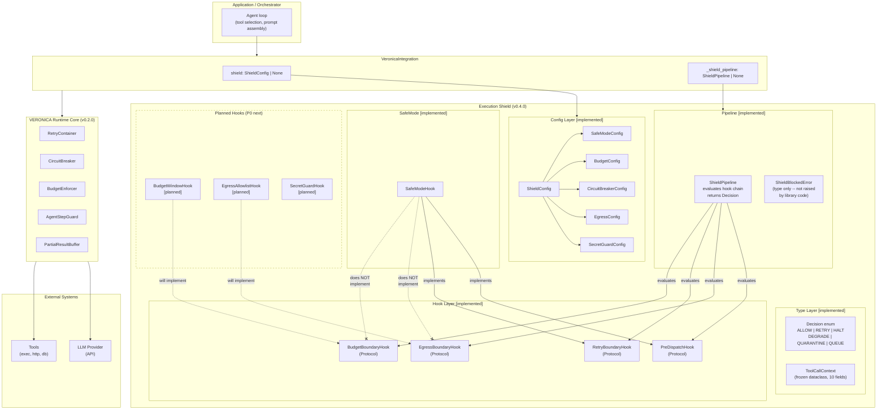
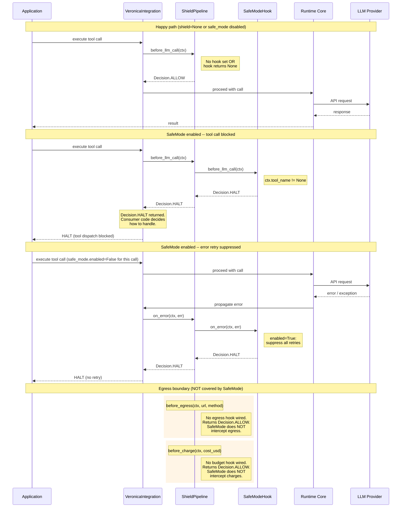
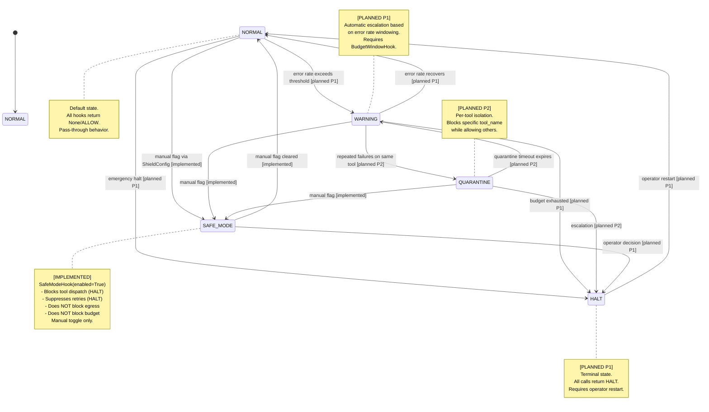

# VERONICA v0.4.0 -- Technical Artifacts

## A. Mermaid Diagrams

### Diagram 1: Static Architecture Layer Diagram



### Diagram 2: Dynamic Request Flow



### Diagram 3: Shield State Machine (forward-looking)



---

## B. Technical Announcement Draft

### Title Options

1. **VERONICA v0.4.0: Execution Shield Foundation -- Typed Boundaries for LLM Agent Failures**
2. **Introducing the VERONICA Execution Shield: Structured Halt Points for Agentic Tool Dispatch**
3. **VERONICA v0.4.0: Why Your LLM Agent Needs a Kill Switch (and How We Built One)**

---

### Announcement

# VERONICA v0.4.0: Execution Shield Foundation

## The problem: deterministic failure loops in LLM agents

LLM agents fail in predictable ways. When an agent calls a tool with
missing arguments, the tool returns an error. The agent retries with
the same missing arguments. The tool returns the same error. This loop
continues until a timeout, a rate limit, or budget exhaustion stops it.

This is a known failure mode. For example, crewAI issue #4495 (March
2025) describes a case where native tool calling bypassed argument
validation, leaving the LLM without schema enforcement feedback. The
result was an infinite retry loop with identical malformed calls -- a
pattern that burned tokens, produced no useful output, and required
manual intervention to stop.

LLM mistakes are expected; the question is whether the runtime
surrounding the LLM has a structured mechanism to detect a loop and
halt it.

VERONICA's existing runtime core (v0.2) addresses individual
primitives -- `RetryContainer`, `CircuitBreaker`, `BudgetEnforcer`,
`AgentStepGuard` -- but these operate independently. There is no
unified interception layer that evaluates a tool call *before* it
reaches the LLM provider, and *after* an error occurs, using
consistent types and a single decision vocabulary.

v0.4.0 introduces that layer.

## What shipped: the Execution Shield foundation

The Execution Shield is a typed hook pipeline that sits between the
application and the runtime core. It intercepts at four boundaries:

| Boundary | Hook Protocol | When evaluated |
|----------|---------------|----------------|
| Pre-dispatch | `PreDispatchHook` | Before every LLM / tool call |
| Egress | `EgressBoundaryHook` | Before outbound HTTP |
| Retry | `RetryBoundaryHook` | When a tool call raises an exception |
| Budget | `BudgetBoundaryHook` | Before recording a cost charge |

Each hook returns a `Decision` -- a six-member `str` enum (`ALLOW`,
`RETRY`, `HALT`, `DEGRADE`, `QUARANTINE`, `QUEUE`) -- or `None` to
defer. The `ShieldPipeline` evaluates each hook and returns `ALLOW` if
no hook has an opinion. This means the default behavior, with no hooks
configured, is complete pass-through. Existing code is unaffected.

The foundation consists of five layers delivered as stacked PRs:

1. **Config layer** (`ShieldConfig` + 5 sub-configs) -- dataclass
   hierarchy, loadable from env vars, JSON, or YAML. All features
   `enabled=False` by default.
2. **Type layer** (`Decision` enum + `ToolCallContext`) -- frozen
   dataclass capturing request ID, tool name, model, token counts,
   cost, and arbitrary metadata.
3. **Hook interfaces** -- four `typing.Protocol` definitions with
   `@runtime_checkable`, plus four noop implementations for testing.
4. **Pipeline skeleton** (`ShieldPipeline` + `ShieldBlockedError`) --
   evaluates the hook chain, returns `Decision`. Stored as
   `VeronicaIntegration._shield_pipeline` for consumer access, with
   zero behavior change when no hooks are set.
5. **SafeMode** (`SafeModeHook`) -- the first concrete hook
   implementation.

The initial foundation is intentionally small and self-contained.
Zero external dependencies. stdlib only.

## SafeMode: what it does and what it does not

SafeMode is an emergency kill switch. When
`ShieldConfig(safe_mode=SafeModeConfig(enabled=True))` is passed to
`VeronicaIntegration`, two things happen:

- **Pre-dispatch**: any call where `ctx.tool_name` is not `None`
  returns `Decision.HALT`. Pure LLM completions (no tool) pass through.
- **Retry boundary**: any error returns `Decision.HALT`. No retries
  are attempted.

What SafeMode does **not** do:

- It does not intercept HTTP egress (`before_egress` has no hook).
- It does not intercept budget charges (`before_charge` has no hook).
- It does not automatically activate. It is a manual flag in the
  config. There is no error-rate windowing or automatic escalation
  today.
- No library code raises `ShieldBlockedError`. The pipeline returns
  a `Decision`; the caller decides how to handle it.
  `ShieldBlockedError` is exported as a convenience type for
  consumer code that wants a structured exception.

This scope is intentional. SafeMode addresses the most immediate
failure mode -- the deterministic retry loop -- while the egress and
budget boundaries require their own hook implementations with
different configuration surfaces.

## Why opt-in and pass-through by default

Every shield feature is disabled by default. `ShieldConfig()` with no
arguments produces a config where `is_any_enabled` returns `False`.
When `shield=None` (the default for `VeronicaIntegration`), no
pipeline is created at all.

This matters because VERONICA is a library, not a framework. Users
who upgrade from v0.2 to v0.4 see no behavior change, no new
exceptions, no new failure modes. They opt in to specific shield
features when they are ready.

The hook protocol design also means users can implement their own
hooks. Any object with the right method signature satisfies the
`Protocol` and can be passed to `ShieldPipeline`. No inheritance,
no registration, no decorators.

## Roadmap: what comes next

The following are the immediate P0 priorities for the shield layer:

- **Budget window hook**: implements `BudgetBoundaryHook`. Tracks
  token/call/cost consumption over a sliding time window.
  Returns `HALT` when a threshold is exceeded. Replaces the
  standalone `BudgetEnforcer` for shield-aware deployments.
- **Egress allowlist hook**: implements `EgressBoundaryHook`.
  Default-deny for outbound HTTP. Allows only hosts listed in
  `EgressConfig.allowed_hosts`.
- **SecretGuard hook**: scans outbound payloads against
  `SecretGuardConfig.patterns` before egress. Returns `QUARANTINE`
  if a credential pattern is detected.

Planned for P1: automatic state transitions (NORMAL -> WARNING ->
HALT) based on error-rate windowing, and integration of
`CircuitBreaker` state with the shield pipeline.

Planned for P2: per-tool quarantine (`QUARANTINE` decision scoped to
a specific `tool_name`) and the `DEGRADE` / `QUEUE` decision
handlers.

## Installation and usage

```python
from veronica_core import VeronicaIntegration
from veronica_core.shield import ShieldConfig, SafeModeConfig

# Default: no shield, no behavior change
vi = VeronicaIntegration()

# With SafeMode enabled
vi = VeronicaIntegration(
    shield=ShieldConfig(safe_mode=SafeModeConfig(enabled=True))
)

# From environment variable: VERONICA_SAFE_MODE=1
vi = VeronicaIntegration(shield=ShieldConfig.from_env())
```

166 tests passing, 4 xfailed (pre-existing). Zero external
dependencies. Python >= 3.9. stdlib only.

---

Apache-2.0. Python >=3.9. No external runtime dependencies.
